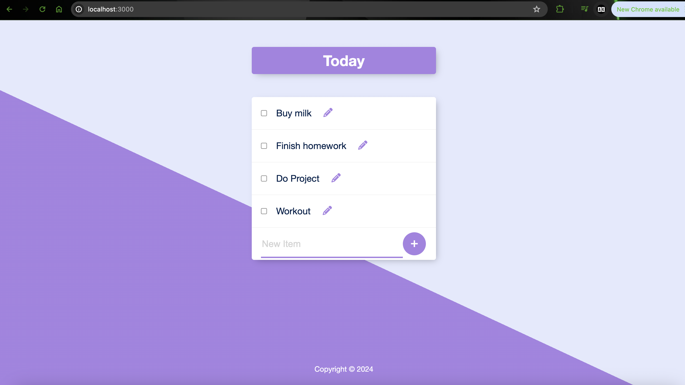

# To Do List

This is a simple CRUD based To Do List web application that allows users to create, read, update, and delete items from the list.  

## Link to the app 👇:

## Technologies used:

- EJS
- CSS
- Bootstrap
- JavaScript
- Express
- Node
- npm
- Axios
- Bodyparser
- SQL
- Postgres
- PgAdmin

## Screenshots:

